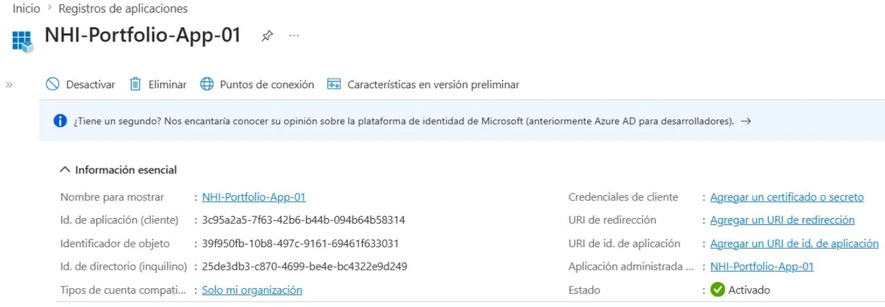
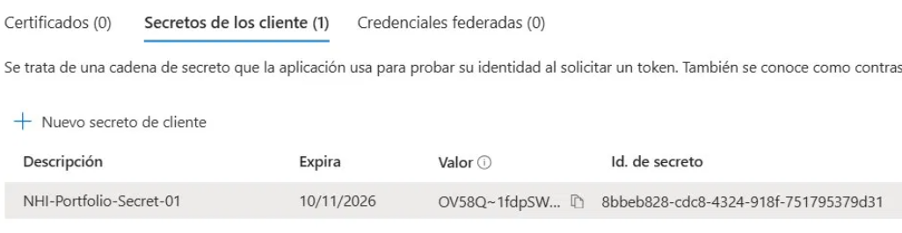
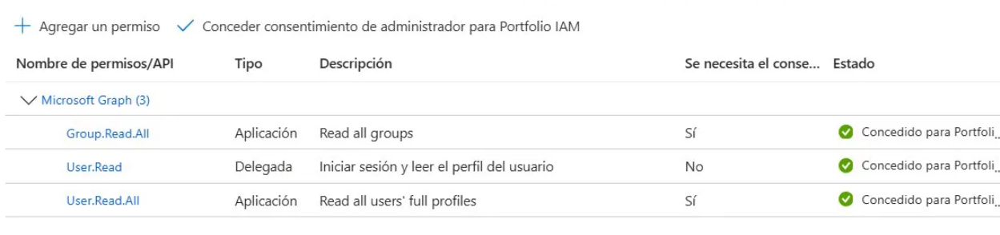
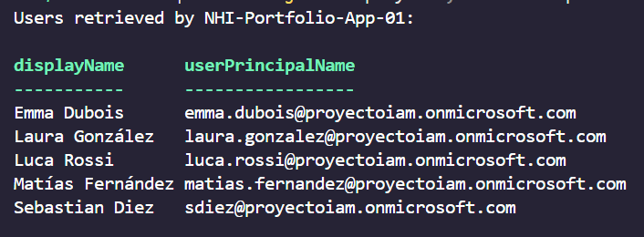

# Module 1 — Foundations: App Registrations, Service Principals & Managed Identities

## Overview

This module establishes the conceptual and practical foundation for Non-Human Identity (NHI) governance. Before automating or auditing NHI, you must understand what they are, how they authenticate, and why they represent one of the most critical — and most overlooked — attack surfaces in enterprise identity security.

---

## The Core Problem

In most organizations, identity governance focuses on human users. But humans are outnumbered:

```
Typical mid-size organization:
    Human identities:      ~500 users
    Non-Human identities:  ~5,000 - 50,000
                           (apps, scripts, pipelines, APIs, services)
```

These non-human identities authenticate silently, run 24/7, and are rarely reviewed. When compromised, they provide persistent, privileged access with no MFA challenge and no user to notice unusual behavior.

> **80% of modern breaches involve compromised non-human credentials.**  
> Unrotated secrets, over-privileged Service Principals, and forgotten App Registrations are the primary vectors.

---

## The Three NHI Types in Entra ID

### App Registration vs Service Principal

The most common source of confusion in NHI governance:

```
App Registration = The blueprint
                   Defines WHAT the application is
                   Exists in ONE tenant (where it was created)
                   Where you configure permissions, secrets, certificates

Service Principal = The local instance
                    Represents the app IN a specific tenant
                    Created automatically when an app is registered
                    What Entra ID uses to evaluate access at runtime
```

Real-world analogy:

```
Microsoft creates the App Registration for "Microsoft Teams"
    → exists in Microsoft's tenant

Your company installs Teams
    → a Service Principal for Teams is created in YOUR tenant
    → that SP has the permissions your admin approved
    → that SP is what Entra ID governs in your organization
```

When you create your own App Registration:

```
You register an app in your tenant
    → a Service Principal is automatically created in the same tenant
    → for single-tenant apps: they are tightly coupled
    → for multi-tenant apps: a new SP is created in every tenant that installs it
```

### Managed Identity

The modern alternative to App Registration + Secret for Azure-hosted workloads:

```
Without Managed Identity (problematic):
    VM needs to read a Key Vault
    → Create App Registration
    → Generate Client Secret
    → Store secret in script or environment variable
    → Secret expires → someone must rotate it manually
    → If secret leaks → compromised until rotated

With Managed Identity (recommended):
    Azure manages the identity automatically
    → No secrets, no passwords, no certificates to manage
    → No manual rotation
    → If the VM is deleted → identity disappears automatically
    → Nothing to steal — the secret never exists as a retrievable value
```

| Type | Use Case |
|---|---|
| **Managed Identity (System-assigned)** | The resource needing access IS an Azure resource (VM, Function App, Container). Lifecycle tied to the resource. |
| **Managed Identity (User-assigned)** | Multiple Azure resources need the same identity. Lifecycle independent from any single resource. |
| **App Registration + Service Principal** | External applications, local scripts, third-party integrations, or when full control over the identity is required. |

---

## Application vs Delegated Permissions

This distinction is fundamental to understanding NHI risk:

```
Delegated permissions:
    The app acts ON BEHALF of a user
    → User must be present (actively signed in)
    → Permissions = intersection of app permissions AND user permissions
    → If the user can't do something, the app can't either
    → Example: calendar app reading YOUR meetings

Application permissions:
    The app acts BY ITSELF, without a user
    → Runs in background, no user session required
    → Has whatever permissions an admin explicitly granted
    → Can access ALL resources of the permitted type
    → Example: script reading ALL users in the tenant
```

The risk amplification:

```
Application permission "Mail.ReadWrite"
    → The app can read AND modify email for ALL users in the tenant
    → Silently, in the background, without any user knowing
    → If the app's secret is leaked → full access to corporate email
    → No MFA to stop the attacker
```

This is why **least privilege is more critical for NHI than for human users** — and why Module 4 audits these permissions systematically.

---

## OAuth2 Client Credentials Flow

How NHI authenticate — no browser, no user, no MFA:

```
Script / Application
        │
        │  POST /oauth2/v2.0/token
        │  client_id = "app-id"
        │  client_secret = "secret-value"
        │  grant_type = "client_credentials"
        │
        ▼
Microsoft Entra ID
        │
        │  Validates credentials
        │  Checks admin-consented permissions
        │
        ▼
        Access Token (JWT, valid 60 minutes)
        │
        ▼
Microsoft Graph API
        │
        │  Returns requested data
        │  (users, groups, emails, files...)
        ▼
Script receives data — no human involved
```

The token is a **JSON Web Token (JWT)** containing the app's identity and granted permissions. Any system that receives this token can verify it was issued by Entra ID and act on it.

---

## Hands-On: First App Registration

### Created in Portal

**NHI-Portfolio-App-01** was registered with the following configuration:

| Property | Value | Rationale |
|---|---|---|
| Account type | Single tenant | Least privilege — internal apps only |
| Redirect URI | None | No user-facing interface — background service |
| Credentials | Client Secret (6 months) | Demonstration purposes — Module 2 replaces with certificate |
| Permissions | User.Read.All, Group.Read.All | Minimum required for NHI audit use case |



### Client Secret Created



> **Note on secret visibility:** The secret value is shown exactly once — immediately after creation. If the page is closed before copying it, the value is permanently lost and a new secret must be generated. This is by design: Entra ID never stores the plaintext secret value.

### API Permissions with Admin Consent



> **Observed:** Entra ID automatically added `User.Read` (Delegated) when the app was registered. This default permission allows a user to sign in and read their own profile. It was not explicitly requested — demonstrating why NHI audits must inventory **all** permissions, including defaults.

### Admin Consent Requirement

Application permissions always require explicit admin approval:

```
Without admin consent:
    Permission status: "Not granted" ⚠️
    App cannot use the permission even if it's listed

After admin consent:
    Permission status: "Granted for [tenant]" ✅
    App can now use the permission for all tenant resources
```

This is a critical security control — apps cannot self-grant access to tenant-wide resources.

---

## Proof of Concept: NHI Authenticating to Graph API

Using the OAuth2 Client Credentials Flow, **NHI-Portfolio-App-01** authenticated without any human user and retrieved tenant user data:

```powershell
# Step 1: Obtain token using client credentials
$TokenBody = @{
    grant_type    = "client_credentials"
    client_id     = $ClientId
    client_secret = $ClientSecret
    scope         = "https://graph.microsoft.com/.default"
}

$TokenResponse = Invoke-RestMethod `
    -Uri "https://login.microsoftonline.com/$TenantId/oauth2/v2.0/token" `
    -Method POST `
    -Body $TokenBody

# Step 2: Call Graph API with the token
$Headers = @{ Authorization = "Bearer $($TokenResponse.access_token)" }
$Users   = Invoke-RestMethod `
    -Uri "https://graph.microsoft.com/v1.0/users?`$top=5" `
    -Headers $Headers
```



The NHI successfully retrieved user profiles from the tenant — **no human identity involved, no MFA required, no sign-in prompt**.

This demonstrates both the power and the risk: the same capability that enables legitimate automation also enables silent, persistent access if credentials are compromised.

---

## Security Risk Analysis — What This Demonstrates

```
What was built in this module:
    App Registration with Client Secret + User.Read.All + Group.Read.All

What an attacker gains if the secret is leaked:
    ├── Read all user profiles (names, emails, phone numbers, job titles)
    ├── Read all group memberships (org structure, security groups)
    ├── Persistent access until secret expires (up to 6 months)
    ├── Access from anywhere in the world
    ├── No MFA challenge
    └── No user session to detect or terminate
```

This is why NHI governance is critical — and why Module 4 will build automated detection for exactly these conditions.

---

## GDPR Implications

| Article | NHI Relevance |
|---|---|
| Art. 25 — Privacy by Design | NHI permissions must follow least privilege from creation, not added retroactively |
| Art. 32 — Technical measures | Client Secrets are insufficient for production — certificates required (Module 2) |
| Art. 5(1)(f) — Confidentiality | Secret rotation and expiry monitoring are mandatory technical controls |
| Art. 30 — Records of processing | Every NHI with data access permissions is a data processor — must be inventoried |

> **GDPR Art. 30 implication:** An App Registration with `User.Read.All` is processing personal data (user profiles). Under GDPR, this processing activity must be documented in the Records of Processing Activities (RoPA). Most organizations have no inventory of which NHI are processing personal data — Module 4 addresses this gap.

---

## Key Concepts Summary

| Concept | Definition |
|---|---|
| App Registration | The blueprint — defines the application's identity and configuration |
| Service Principal | The runtime instance — what Entra ID evaluates for access decisions |
| Managed Identity | Azure-managed identity with no credentials to store or rotate |
| Client Secret | Password-equivalent credential — single display, expiry required |
| Application Permission | App acts independently — accesses all tenant resources of the permitted type |
| Delegated Permission | App acts as the signed-in user — limited to that user's own access |
| Admin Consent | Explicit admin approval required for Application permissions |
| Client Credentials Flow | OAuth2 flow for NHI — no user, no browser, no MFA |

---

## What's Next

Module 1 demonstrated that a Client Secret is functional but fundamentally insecure for production use:

```
Client Secret problems:
    ├── Travels over the network on every authentication
    ├── Can be copied and used from anywhere
    ├── If logged accidentally → immediately compromised
    └── Requires manual tracking and rotation
```

**Module 2** replaces the Client Secret with a **certificate** — where the private key never leaves your machine and Entra ID only ever sees the public key. Even if the authentication traffic is intercepted, the credential cannot be replicated.

---

## Repository Structure

```
Module1-Foundations/
├── README.md                          # This document
└── docs/
    └── screenshots/
        ├── 01-app-registration-overview.png
        ├── 02-client-secret-created.png
        ├── 03-api-permissions-granted.png
        └── 04-nhi-graph-api-call.png
```

---

*All App Registrations and credentials in this module were created in an evaluation tenant using synthetic data. Client Secrets shown have been rotated and are no longer valid.*