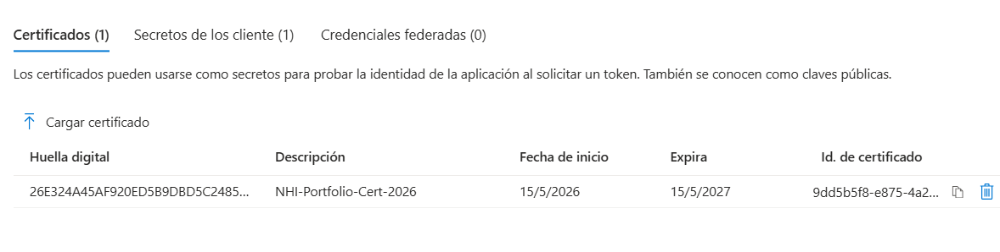
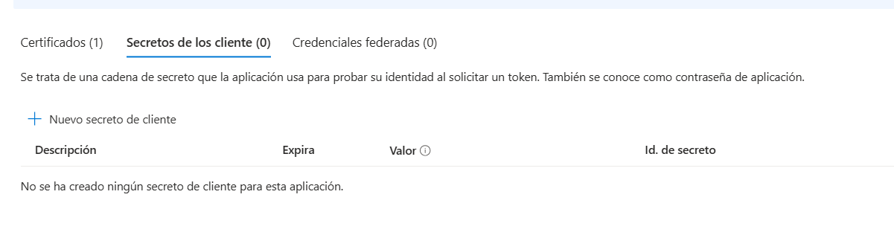
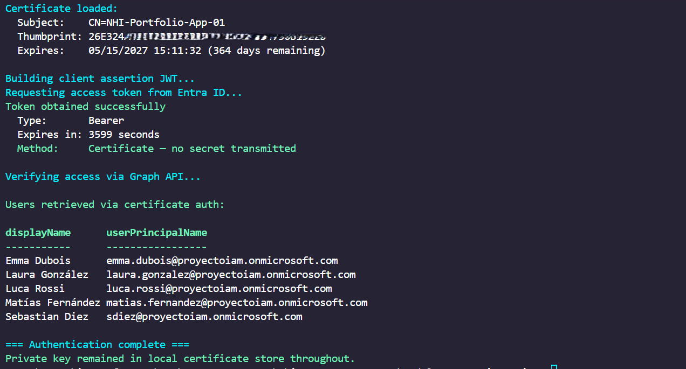

# Module 2 — Secure App Registration & Certificate-Based Authentication

## Overview

This module replaces the Client Secret created in Module 1 with a **certificate-based credential** — the production standard for Non-Human Identity authentication. The core principle: the private key never leaves the local machine, and Entra ID never sees a reusable secret.

---

## Why Client Secrets Are Insufficient for Production

Module 1 demonstrated that a Client Secret works — but working is not the same as secure:

```
Client Secret problems:
    ├── Travels over the network on every token request
    ├── Can be copied and used from any machine worldwide
    ├── If accidentally logged → immediately compromised
    ├── If committed to a repository → immediately compromised
    ├── Entra ID cannot distinguish legitimate use from attacker use
    └── Requires manual tracking and rotation every 6-24 months
```

A leaked Client Secret gives an attacker **identical access** to the legitimate application — silently, persistently, from anywhere in the world, with no MFA to stop them.

---

## How Certificate Authentication Works

Certificate authentication uses **asymmetric cryptography** — two mathematically related keys:

```
Private Key:                        Public Key:
├── Only you possess it             ├── Anyone can know it
├── Never leaves your machine       ├── Uploaded to Entra ID
├── Used to SIGN assertions         ├── Used by Entra ID to VERIFY signatures
└── If lost → revoke and reissue    └── Useless without the private key
```

Authentication flow:

```
Your script:
    1. Builds a JWT with app identity claims
    2. SIGNS the JWT with the private key
    3. Sends the signed JWT to Entra ID
            ↓
Entra ID:
    4. Receives the signed JWT
    5. Verifies the signature using the uploaded public key
    6. If valid → issues access token
            ↓
Result:
    Private key never left your machine
    No reusable credential was transmitted
    Intercepted traffic is cryptographically useless to an attacker
```

---

## Comparison: Secret vs Certificate

| Property | Client Secret | Certificate |
|---|---|---|
| Credential transmitted | Yes — full secret value | No — only a cryptographic signature |
| Usable if intercepted | Yes — immediately | No — signature is single-use |
| Usable from any machine | Yes | No — requires private key |
| Manual rotation required | Yes — every 6-24 months | Yes — but with advance warning |
| Accidental exposure risk | High — plain text value | Low — public key is not sensitive |
| Production recommendation | ❌ Avoid | ✅ Standard |

---

## GDPR Compliance Mapping

| Article | Requirement | Implementation |
|---|---|---|
| Art. 32(1) | Technical security measures | Certificate auth eliminates credential interception risk |
| Art. 5(1)(f) | Confidentiality & integrity | Private key never transmitted — cannot be intercepted |
| Art. 32(2) | Risk assessment | Certificate is proportionate to the risk of NHI credential exposure |

---

## Step-by-Step Implementation

### Step 1 — Generate Self-Signed Certificate

```powershell
$CertParams = @{
    Subject           = "CN=NHI-Portfolio-App-01"
    CertStoreLocation = "Cert:\CurrentUser\My"
    KeyExportPolicy   = "Exportable"
    KeySpec           = "Signature"
    KeyLength         = 2048
    HashAlgorithm     = "SHA256"
    NotAfter          = (Get-Date).AddYears(1)
}

$Cert = New-SelfSignedCertificate @CertParams
Write-Host "Thumbprint: $($Cert.Thumbprint)"
```

> **KeySpec = Signature:** the certificate is created specifically for digital signing, not encryption. This follows the principle of purpose limitation — credentials should only be usable for their intended function.

> **KeyLength = 2048:** minimum recommended RSA key length. In production, 4096-bit keys are preferred for long-lived certificates.

### Step 2 — Export Public Key

```powershell
Export-Certificate `
    -Cert     "Cert:\CurrentUser\My\$($Cert.Thumbprint)" `
    -FilePath ".\NHI-Portfolio-App-01.cer" `
    -Force
```

> The `.cer` file contains **only the public key**. It is safe to share, upload, or store anywhere — it has no value without the corresponding private key.

### Step 3 — Upload to Entra ID

Portal: App registrations → NHI-Portfolio-App-01 → Certificates & secrets → **Certificates** → Upload certificate



### Step 4 — Delete the Client Secret

With certificate authentication confirmed, the Client Secret has no further purpose. Every active credential is an attack surface:

Portal: Certificates & secrets → Client secrets → `...` → **Delete**



> **Why delete immediately:** an application with both a certificate and an active secret has two credential vectors instead of one. The secret provides no additional capability — only additional risk.

---

## The OAuth2 Client Credentials Flow with Certificate

Instead of sending `client_secret`, certificate authentication sends a **signed JWT client assertion**:

```
Standard flow (secret):
    POST /token
    client_secret = "OV58Q~plaintext..."     ← reusable if intercepted

Certificate flow (assertion):
    POST /token
    client_assertion = "eyJhbGc..."          ← single-use signed JWT
    client_assertion_type = "urn:ietf:params:oauth:client-assertion-type:jwt-bearer"
```

The JWT assertion contains:

```json
Header: {
    "alg": "RS256",
    "typ": "JWT",
    "x5t": "<base64url-thumbprint>"    ← tells Entra ID which public key to use
}

Payload: {
    "aud": "https://login.microsoftonline.com/{tenant}/oauth2/v2.0/token",
    "iss": "<client-id>",
    "sub": "<client-id>",
    "jti": "<unique-guid>",            ← prevents replay attacks
    "nbf": <unix-timestamp>,
    "exp": <unix-timestamp + 5min>     ← assertion valid for 5 minutes only
}

Signature: <RSA-SHA256 signature using private key>
```

---

## Script: Connect-NHIWithCertificate.ps1

The script encapsulates the full certificate authentication flow into reusable functions:

```
Connect-NHIWithCertificate.ps1
├── Get-NHICertificate()      — Loads cert from store, validates expiry
│                               Warns if expiring within 30 days
├── New-ClientAssertion()     — Builds and signs the JWT assertion
│                               Private key access via .NET RSA API
│                               Key never extracted — only used for signing
├── Get-NHIAccessToken()      — Exchanges assertion for access token
└── Main execution            — Verifies token with a Graph API call
```

### Usage

```powershell
.\Connect-NHIWithCertificate.ps1 `
    -Thumbprint YOUR-CERT-THUMBPRINT `
    -TenantId   YOUR-TENANT-ID `
    -ClientId   YOUR-CLIENT-ID
```

### Output



```
=== NHI Certificate Authentication ===
Certificate loaded:
  Subject:    CN=NHI-Portfolio-App-01
  Thumbprint: [redacted]
  Expires:    15/05/2027 (365 days remaining)

Building client assertion JWT...
Requesting access token from Entra ID...
Token obtained successfully
  Type:       Bearer
  Expires in: 3599 seconds
  Method:     Certificate — no secret transmitted

Users retrieved via certificate auth:
displayName        userPrincipalName
-----------        -----------------
Emma Dubois        emma.dubois@...
Laura González     laura.gonzalez@...
Luca Rossi         luca.rossi@...
Matías Fernández   matias.fernandez@...
Sebastian Diez     sdiez@...

=== Authentication complete ===
Private key remained in local certificate store throughout.
```

---

## Security Practices Demonstrated

- **Private key isolation** — key never extracted from Windows certificate store
- **Single-use assertions** — each JWT has a unique `jti` claim and 5-minute expiry
- **Replay attack prevention** — `jti` (JWT ID) ensures each assertion is unique
- **Expiry monitoring** — script warns when certificate is within 30 days of expiry
- **Credential minimization** — Client Secret deleted once certificate confirmed working
- **Purpose-limited certificate** — `KeySpec=Signature` restricts use to signing only

---

## Certificate Lifecycle — Production Considerations

```
Self-signed certificate (this portfolio):
    ├── Generated locally
    ├── No Certificate Authority validation
    ├── Sufficient for development and portfolio demonstration
    └── Not trusted by external systems

Production certificate (enterprise standard):
    ├── Issued by internal CA (Active Directory Certificate Services)
    │   or public CA (DigiCert, Sectigo)
    ├── Validated identity — trusted by external systems
    ├── Managed via certificate lifecycle tools
    └── Automated rotation via Key Vault (covered in Module 4)
```

**Rotation process for production:**
```
1. Generate new certificate (before current expires)
2. Upload new public key to App Registration
3. Both certificates active during transition window
4. Update all scripts/services to use new thumbprint
5. Delete old certificate from App Registration
6. Verify no systems still using old certificate
```

---

## Repository Structure

```
Module2-AppRegistration/
├── README.md                              # This document
├── Connect-NHIWithCertificate.ps1         # Certificate authentication script
└── docs/
    └── screenshots/
        ├── 05-certificate-uploaded.png    # Portal: certificate in App Registration
        ├── 06-secret-deleted.png          # Portal: Client Secret removed
        └── 07-cert-auth-output.png        # Terminal: successful certificate auth
```

---

## What's Next

Modules 1 and 2 covered NHI built on **App Registrations** — identities you create and manage manually. Module 3 introduces **Managed Identities** — Azure-native identities with no credentials to create, store, rotate, or protect.

```
App Registration + Certificate:    You manage the identity lifecycle
Managed Identity:                  Azure manages everything automatically
                                   No certificate, no secret, no rotation
                                   The gold standard for Azure-hosted workloads
```

---

*All credentials shown in this module have been rotated or deleted. The certificate thumbprint in screenshots has been redacted following security best practices.*