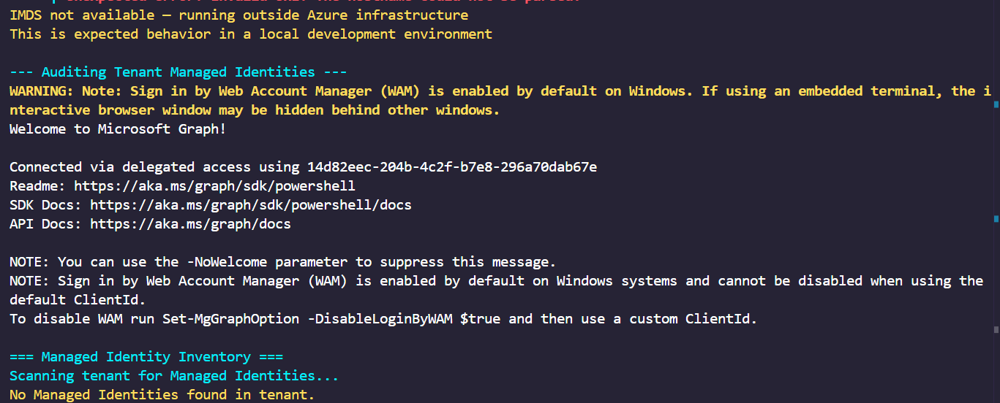

# Module 3 — Managed Identities: Zero-Credential NHI Authentication

## Overview

This module introduces **Managed Identities** — the evolution of Non-Human Identity authentication in Azure. Where Modules 1 and 2 required creating, storing, and rotating credentials, Managed Identities eliminate the credential entirely. Azure manages the identity lifecycle automatically, and the private key never exists as a retrievable value.

---

## The Credential Problem — A Progressive Solution

Each module in this portfolio represents a step forward in NHI security:

```
Module 1 — Client Secret:
    You create a password → store it → transmit it → rotate it → risk leaking it

Module 2 — Certificate:
    You create a key pair → store the private key → sign assertions → rotate annually
    Private key stays local — but you still manage the lifecycle

Module 3 — Managed Identity:
    Azure creates the identity → Azure manages the credentials → Azure rotates automatically
    No secret exists → nothing to store → nothing to transmit → nothing to leak
```

Managed Identity is not just a better credential — it is the **elimination of the credential problem** for Azure-hosted workloads.

---

## How Managed Identities Work

When Managed Identity is enabled on an Azure resource:

```
Azure automatically:
    ├── Creates a Service Principal in Entra ID
    ├── Generates credentials internally (never accessible to humans)
    ├── Rotates those credentials automatically
    └── Deletes the Service Principal when the resource is deleted (system-assigned)
```

When code running inside that resource needs a token:

```
Code inside VM/Function/Container:
        │
        │  GET http://169.254.169.254/metadata/identity/oauth2/token
        │  Headers: Metadata: true
        │
        ▼
Azure Instance Metadata Service (IMDS):
        │
        │  Internal credential exchange (never visible externally)
        │
        ▼
        Access Token → code uses it to call APIs
```

The IP address `169.254.169.254` is the **Azure Instance Metadata Service** — a link-local address accessible only from within Azure infrastructure. No external system can reach it, making it a security boundary by design.

---

## System-Assigned vs User-Assigned

| Property | System-Assigned | User-Assigned |
|---|---|---|
| Lifecycle | Tied to the resource | Independent |
| Scope | One resource → one identity | One identity → multiple resources |
| When resource deleted | Identity deleted automatically | Identity persists |
| Use case | Single VM or Function App | Multiple resources needing shared identity |
| Creation | Enabled on the resource directly | Created independently, then assigned |

### System-Assigned Example

```
Azure VM "vm-hrprocessor"
    └── System-assigned MI enabled
        └── Service Principal created: "vm-hrprocessor" (auto-named)
            └── Assigned: Storage.Read permission
            └── If VM is deleted → SP deleted automatically
```

### User-Assigned Example

```
User-assigned MI: "mi-dataprocessor"
    ├── Assigned to VM "vm-processor-01"
    ├── Assigned to VM "vm-processor-02"
    ├── Assigned to Function App "fn-nightly-report"
    └── All three use the same identity and permissions
        └── If any resource is deleted → MI persists
```

---

## Authentication Flow Comparison

```
Module 2 — Certificate (for reference):
    Script → builds JWT → signs with private key → sends to Entra ID → receives token
    Private key stays local but YOU manage it

Module 3 — Managed Identity:
    Code → calls IMDS → Azure exchanges credentials internally → code receives token
    No key, no JWT, no signing — Azure handles everything
```

Code comparison:

```powershell
# Module 2 — Certificate (your responsibility)
$Cert       = Get-Item "Cert:\CurrentUser\My\$Thumbprint"
$Assertion  = New-ClientAssertion -Certificate $Cert ...
$Token      = Get-Token -Assertion $Assertion ...

# Module 3 — Managed Identity (Azure's responsibility)
$Token = Invoke-RestMethod `
    -Uri "http://169.254.169.254/metadata/identity/oauth2/token?resource=..." `
    -Headers @{ Metadata = "true" }
# That's it. No credentials anywhere in this code.
```

---

## GDPR Compliance Mapping

| Article | Requirement | Implementation |
|---|---|---|
| Art. 32(1) | Technical security measures | No credentials exist to intercept, leak, or steal |
| Art. 25 | Privacy by Design | Identity lifecycle managed by platform — secure by default |
| Art. 5(1)(f) | Confidentiality | Private key never exists as a retrievable value |
| Art. 5(1)(e) | Storage limitation | System-assigned MI deleted automatically with resource |

> **GDPR Art. 5(1)(e) alignment:** System-assigned Managed Identities implement storage limitation natively — when the resource that needed the identity is deleted, the identity is deleted automatically. No orphaned Service Principals, no forgotten credentials. This is Privacy by Design at the platform level.

---

## Script: Get-ManagedIdentityToken.ps1

The script demonstrates two capabilities:

```
Get-ManagedIdentityToken.ps1
├── Get-ManagedIdentityToken()        — IMDS-based authentication
│   ├── Calls Azure Instance Metadata Service
│   ├── Supports both System and User-assigned MI
│   └── Graceful degradation outside Azure infrastructure
└── Get-ManagedIdentityInventory()    — Tenant audit
    ├── Scans for all ManagedIdentity-type Service Principals
    ├── Reports assigned permissions per identity
    └── Identifies MIs with no owner or excessive permissions
```

### Graceful Degradation

The script is designed to run in any environment — including local development machines where IMDS is not available:

```powershell
} catch {
    if ($_.Exception.Message -match "Unable to connect" -or
        $_.Exception.Message -match "actively refused") {
        Write-Warning "IMDS endpoint not reachable — running outside Azure infrastructure."
        Write-Warning "Deploy to an Azure VM or Function App with Managed Identity enabled."
    }
}
```

This pattern is important for portfolio scripts — they should never crash unexpectedly, even when environment constraints prevent full execution.

---

## Evidence

### Script Execution Output



The output demonstrates two behaviors:

**IMDS Authentication (graceful degradation):**
```
IMDS not available — running outside Azure infrastructure
This is expected behavior in a local development environment
```

**Tenant Audit:**
```
=== Managed Identity Inventory ===
Scanning tenant for Managed Identities...
No Managed Identities found in tenant.
```

The absence of Managed Identities in the tenant confirms the environment limitation — and validates that the audit script works correctly. In a production tenant with Azure resources, this inventory would list every MI, its assigned permissions, and flag any governance gaps.

---

## Environment Limitation

```
Managed Identity authentication requires an Azure-hosted resource.

What works in this evaluation tenant:
    ✅ Tenant audit — scanning for existing Managed Identities
    ✅ Graceful IMDS degradation — script handles absence correctly
    ✅ Full code implementation — production-ready authentication logic

What requires an Azure subscription:
    ⚠️  Active IMDS authentication — needs VM, Function App, or Container
    ⚠️  Creating Managed Identity resources — requires Azure Resource Manager

In a production environment with an Azure subscription, the IMDS
authentication function would execute and return a valid token without
any credentials in the code.
```

---

## Why Managed Identity Is the Gold Standard

```
Threat model comparison:

Scenario: attacker gains read access to your codebase

Client Secret:    secret is in the code → immediately compromised
Certificate:      thumbprint is in the code → attacker needs private key
                  (better, but key location may be discoverable)
Managed Identity: no credential in the code → nothing to steal
                  attacker would need to compromise the Azure resource itself
```

The attack surface is reduced to the Azure infrastructure itself — which has its own defense layers (network security, Azure Defender, resource locks) that are orders of magnitude harder to bypass than a leaked secret in a GitHub repository.

---

## Production Implementation Guide

### Enable System-Assigned MI on a VM

```powershell
# Azure PowerShell (requires Az module)
Set-AzVM -ResourceGroupName "rg-production" `
         -Name "vm-hrprocessor" `
         -IdentityType SystemAssigned
```

### Assign Permissions to the MI

```powershell
# Get the MI's Service Principal ID
$MI = Get-AzADServicePrincipal -DisplayName "vm-hrprocessor"

# Assign Microsoft Graph permission
New-MgServicePrincipalAppRoleAssignment `
    -ServicePrincipalId $MI.Id `
    -PrincipalId        $MI.Id `
    -ResourceId         (Get-MgServicePrincipal -Filter "displayName eq 'Microsoft Graph'").Id `
    -AppRoleId          "df021288-bdef-4463-88db-98f22de89214"  # User.Read.All
```

### Use MI in Code (inside Azure resource)

```powershell
# No credentials — Azure handles authentication
$Token = (Invoke-RestMethod `
    -Uri     "http://169.254.169.254/metadata/identity/oauth2/token?api-version=2018-02-01&resource=https://graph.microsoft.com/" `
    -Headers @{ Metadata = "true" }).access_token

$Users = Invoke-RestMethod `
    -Uri     "https://graph.microsoft.com/v1.0/users" `
    -Headers @{ Authorization = "Bearer $Token" }
```

---

## Module Progression Summary

| Module | Method | Credentials | Management Overhead | Production Fit |
|---|---|---|---|---|
| 1 | Client Secret | Password transmitted | Manual rotation every 6-24 months | ❌ Avoid |
| 2 | Certificate | Signature only | Annual rotation + monitoring | ✅ For non-Azure workloads |
| 3 | Managed Identity | None | Zero | ✅ Gold standard for Azure |

---

## Repository Structure

```
Module3-ManagedIdentity/
├── README.md                              # This document
├── Get-ManagedIdentityToken.ps1           # MI authentication and audit script
└── docs/
    └── screenshots/
        └── 08-managed-identity-audit.png  # Tenant audit output
```

---

## What's Next

Modules 1–3 established how to create and authenticate NHI securely. Module 4 addresses the governance question:

> *"You now have dozens of App Registrations, Service Principals, and potentially Managed Identities across your tenant. How do you know which ones have excessive permissions? Which secrets are about to expire? Which have no owner? Which are processing personal data under GDPR?"*

**Module 4** builds an automated NHI audit script that answers all of these questions — producing a governance report that maps directly to GDPR Article 30 (Records of Processing Activities).

---

*All scripts in this module are designed to run in both Azure-hosted and local environments, with graceful degradation where platform features are unavailable.*