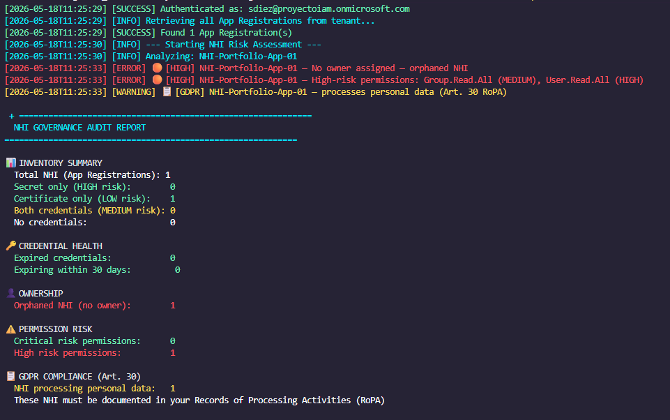
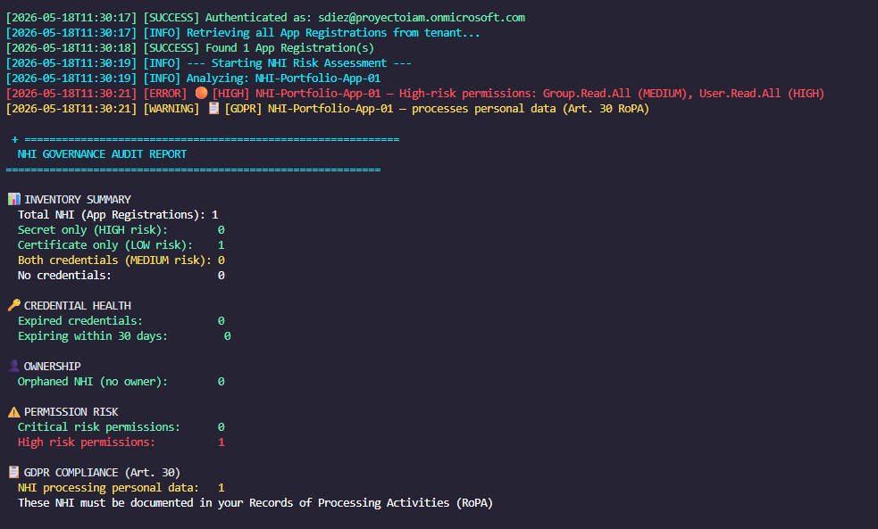
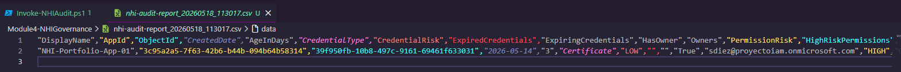

# Module 4 — NHI Audit & Governance Automation

## Overview

This module closes the NHI governance lifecycle by implementing automated discovery, risk assessment, and compliance mapping across all Non-Human Identities in the tenant. Where Modules 1–3 established how to create and authenticate NHI securely, Module 4 answers the operational question that no manual process can answer at scale:

> *"What is actually happening with all the NHI in our organization?"*

---

## The Visibility Problem

After 2–3 years of typical enterprise operation, a tenant accumulates NHI that nobody tracks:

```
App Registrations:              ~200-500
Using secrets (not certs):      ~60%
With expired secrets:           ~30%
Without assigned owners:        ~25%
With excessive permissions:     ~40%
Processing personal data:       ~70% (undocumented)
Active in last 90 days:         ~45% (the rest are zombies)
```

No manual process scales to this. The result is silent vulnerabilities and GDPR compliance gaps that accumulate undetected — until a breach or an audit finds them.

---

## Complete NHI Governance Lifecycle

This module completes the full NHI governance loop:

```
Module 1 ──► Understand how NHI authenticate (App Registration + Secret)
Module 2 ──► Secure NHI credentials (Certificate replaces Secret)
Module 3 ──► Eliminate credentials for Azure workloads (Managed Identity)
Module 4 ──► Audit all NHI continuously — detect drift before it becomes risk  ◄── HERE
    │
    └──► Findings remediated → back to Modules 1-3 for corrections
```

---

## What the Audit Detects

### Credential Risk

```
Secret Only (HIGH risk):
    → Password transmitted on every token request
    → Can be used from any machine if leaked
    → Requires manual rotation tracking

Both Secret + Certificate (MEDIUM risk):
    → Certificate is correct — but secret is redundant attack surface
    → Secret should be removed

Certificate Only (LOW risk):
    → Production standard — private key never transmitted

No Credentials (INFO):
    → May be valid (Managed Identity, federated credential)
    → Requires verification that it's intentional
```

### Expiry Monitoring

```
Expired credentials:
    → Secret/certificate passed its end date
    → App may be broken OR secret was abandoned (worse)
    → Abandoned secrets are active credentials nobody tracks

Expiring within threshold (default 30 days):
    → Rotation required before application breaks
    → Early warning prevents outages
```

### Ownership Gaps

```
No owner assigned:
    → Nobody is accountable for this NHI
    → If the creator left the company → permanently orphaned
    → Governance gap: who approves permission changes?
    → Who gets notified if the secret is about to expire?
```

### Permission Risk Classification

| Risk Level | Examples | Implication |
|---|---|---|
| CRITICAL | `RoleManagement.ReadWrite.All`, `Application.ReadWrite.All`, `Mail.ReadWrite` | Full tenant control or complete mailbox access |
| HIGH | `User.Read.All`, `Directory.Read.All`, `Files.Read.All` | Read all personal data across tenant |
| MEDIUM | `Group.Read.All`, `AuditLog.Read.All`, `Calendars.ReadWrite` | Partial data access or limited write |
| LOW | `User.Read`, `openid`, `profile` | Current user only — minimal risk |

### GDPR Data Processing Mapping (Art. 30)

Any NHI with permissions that grant access to personal data is a **data processor** under GDPR. These must be documented in the Records of Processing Activities (RoPA).

Permissions that trigger GDPR classification:

```
User.Read.All          → employee profiles (name, email, phone, job title)
Mail.Read              → email content
Contacts.ReadWrite     → personal contact information
Files.Read.All         → documents that may contain personal data
Directory.Read.All     → full organizational directory
People.Read.All        → people graph and relationships
```

Most organizations have no inventory of which NHI are processing personal data. This audit produces that inventory automatically.

---

## GDPR Compliance Mapping

| Article | Requirement | Implementation |
|---|---|---|
| Art. 30 | Records of Processing | Identifies every NHI with permissions to access personal data — RoPA foundation |
| Art. 32 | Technical measures | Detects expired credentials, secret-only auth, excessive permissions |
| Art. 25 | Privacy by Design | Flags NHI violating least privilege principle |
| Art. 5(1)(f) | Confidentiality | Expiry monitoring ensures credentials don't silently lapse |
| Art. 5(1)(e) | Storage limitation | Identifies zombie NHI — unused apps that still have active credentials |

---

## Audit Results — NHI-Portfolio-App-01

The audit script analyzed the App Registration created in Modules 1–2 and identified three real findings:

### Finding 1 — No Owner Assigned [HIGH]

```
🟠 [HIGH] NHI-Portfolio-App-01 — No owner assigned — orphaned NHI
```

**Risk:** No accountability for this identity. If credentials expire, nobody is notified. If permissions need review, there is no responsible party.

**Remediation:** Assign the IAM administrator as owner via Microsoft Graph.

### Finding 2 — High-Risk Permissions [HIGH]

```
🟠 [HIGH] NHI-Portfolio-App-01 — High-risk permissions: User.Read.All (HIGH)
```

**Risk:** This NHI can read all user profiles in the tenant. If the certificate is compromised, the attacker has full read access to the organizational directory.

**Assessment:** Permission is intentional for the NHI governance use case — documented and accepted risk.

### Finding 3 — GDPR Data Processor [WARNING]

```
📋 [GDPR] NHI-Portfolio-App-01 — processes personal data (Art. 30 RoPA)
```

**Risk:** `User.Read.All` grants access to personal data (names, emails, phone numbers, job titles). This processing activity must be documented in the RoPA.

**Action:** Added to Records of Processing Activities as: *"NHI Governance Audit — reads user profiles for security inventory purposes."*

---

## Audit Report



### After Remediation — Owner Assigned

Following the audit findings, the owner gap was remediated:

```powershell
New-MgApplicationOwnerByRef -ApplicationId $AppObjectId -BodyParameter @{
    "@odata.id" = "https://graph.microsoft.com/v1.0/directoryObjects/$UserId"
}
```

Second audit run confirmed remediation:



```
Orphaned NHI (no owner): 0  ✅
```

This demonstrates the governance cycle: **audit → finding → remediation → re-audit → confirmed**.

### CSV Export



The CSV export provides structured evidence for:
- GDPR Art. 30 RoPA documentation
- Security team review and sign-off
- Audit trail for compliance assessments
- Input for remediation tracking

---

## Script Architecture

```
Invoke-NHIAudit.ps1
│
├── REGION 1: INITIALIZATION
│   ├── Audit log setup (ISO 8601 timestamps)
│   ├── Permission risk classification map
│   └── GDPR data permission list
│
├── REGION 2: DATA COLLECTION
│   ├── Get-AllAppRegistrations()     — retrieves full tenant inventory
│   ├── Get-AppOwners()               — ownership resolution per app
│   ├── Get-ServicePrincipalPermissions() — granted permissions (post-consent)
│   └── Get-PermissionDisplayName()   — resolves GUIDs to readable names
│
├── REGION 3: RISK ASSESSMENT
│   ├── Get-CredentialHealth()        — secret/cert analysis + expiry check
│   ├── Get-PermissionRisk()          — highest risk level across permissions
│   └── Test-GDPRDataProcessor()      — GDPR Art. 30 classification
│
├── REGION 4: AUDIT EXECUTION
│   ├── Per-NHI analysis loop
│   ├── Real-time risk alerts (color-coded by severity)
│   └── Statistics accumulation
│
├── REGION 5: REPORT GENERATION
│   ├── Console summary with emoji risk indicators
│   ├── Structured log file (GDPR audit trail)
│   └── CSV export (RoPA evidence)
│
└── REGION 6: MAIN EXECUTION
    ├── Graph authentication (least privilege scopes)
    ├── Audit orchestration
    └── Graceful disconnect
```

---

## How to Run

### Prerequisites

```powershell
Install-Module Microsoft.Graph.Applications -Scope CurrentUser
```

### Required Permissions

| Permission | Purpose |
|---|---|
| `Application.Read.All` | Read all App Registrations and Service Principals |
| `Directory.Read.All` | Read owners and directory objects |

### Execution

```powershell
cd .\Module4-NHIGovernance\

# Standard audit
.\Invoke-NHIAudit.ps1 -TenantId YOUR-TENANT-ID

# With CSV export for compliance evidence
.\Invoke-NHIAudit.ps1 -TenantId YOUR-TENANT-ID -ExportCsv

# Custom expiry threshold (60 days instead of default 30)
.\Invoke-NHIAudit.ps1 -TenantId YOUR-TENANT-ID -ExpiryWarningDays 60 -ExportCsv
```

### Expected Output

```
[SUCCESS] Authenticated as: admin@yourtenant.onmicrosoft.com
[SUCCESS] Found N App Registration(s)
[INFO]    --- Starting NHI Risk Assessment ---
[INFO]    Analyzing: YourApp-01
[ERROR]   🟠 [HIGH] YourApp-01 — No owner assigned — orphaned NHI
[ERROR]   🟠 [HIGH] YourApp-01 — High-risk permissions: User.Read.All (HIGH)
[WARNING] 📋 [GDPR] YourApp-01 — processes personal data (Art. 30 RoPA)

======================================================
  NHI GOVERNANCE AUDIT REPORT
======================================================

📊 INVENTORY SUMMARY
  Total NHI (App Registrations): N
  Secret only (HIGH risk):        N
  Certificate only (LOW risk):    N

🔑 CREDENTIAL HEALTH
  Expired credentials:            N
  Expiring within 30 days:        N

👤 OWNERSHIP
  Orphaned NHI (no owner):        N

⚠️  PERMISSION RISK
  Critical risk permissions:      N
  High risk permissions:          N

📋 GDPR COMPLIANCE (Art. 30)
  NHI processing personal data:   N
  These NHI must be documented in your Records of Processing Activities (RoPA)
```

---

## Security Practices Demonstrated

- **Least privilege audit scopes** — only `Application.Read.All` and `Directory.Read.All` — no write permissions needed for read-only audit
- **Rate limit compliance** — 300ms delay between API calls respects Graph API throttling limits
- **Graceful permission resolution** — GUID-to-name resolution fails gracefully, never blocking the audit
- **Consistent audit trail** — same ISO 8601 logging pattern across all four modules
- **Actionable output** — findings include remediation context, not just raw data
- **GDPR-aware design** — audit log itself excluded from version control (`.gitignore`)

---

## Repository Structure

```
Module4-NHIGovernance/
├── README.md                              # This document
├── Invoke-NHIAudit.ps1                    # Main governance audit script
├── logs/
│   ├── logs.md                            # Directory notice (GDPR)
│   └── nhi-audit_SUCCESS_sample.log       # Sample audit log
└── docs/
    └── screenshots/
        ├── 09-nhi-audit-report.png        # Full audit report output
        ├── 10-nhi-audit-csv.png           # CSV export evidence
        └── 11-nhi-audit-owner-fixed.png   # Post-remediation audit
```

---

## Portfolio Complete — Full NHI Governance Lifecycle

With Module 4, this portfolio demonstrates a complete Non-Human Identity governance implementation:

```
┌──────────────────────────────────────────────────────────────┐
│              COMPLETE NHI GOVERNANCE LIFECYCLE               │
├──────────────────────────────────────────────────────────────┤
│                                                              │
│  UNDERSTAND        SECURE           ELIMINATE               │
│                                                              │
│  Module 1          Module 2         Module 3                │
│  App Registration  Certificate ──►  Managed Identity        │
│  + Client Secret   replaces         (zero credentials)      │
│  (foundations) ──► Secret           for Azure workloads     │
│                                          │                  │
│                                          ▼                  │
│                                     Module 4                │
│                                     NHI Audit               │
│                                     (continuous governance) │
│                                          │                  │
│                                          └──► REPEAT        │
│                                                             │
└──────────────────────────────────────────────────────────────┘
```

| Module | Topic | Key Concept | GDPR |
|---|---|---|---|
| 1 — App Registration | NHI Foundations | OAuth2 Client Credentials Flow | Art. 25 |
| 2 — Certificate Auth | Secure Credentials | Private key never transmitted | Art. 32 |
| 3 — Managed Identity | Zero Credentials | Platform-managed identity lifecycle | Art. 5(e), 25 |
| 4 — NHI Audit | Continuous Governance | Automated discovery and risk assessment | Art. 30, 32 |

---

*This portfolio was built on a Microsoft 365 E3 + Entra ID P2 evaluation tenant. All NHI created are synthetic and used solely for demonstration purposes. Audit logs and CSV exports are excluded from version control in compliance with GDPR Article 5(1)(f).*